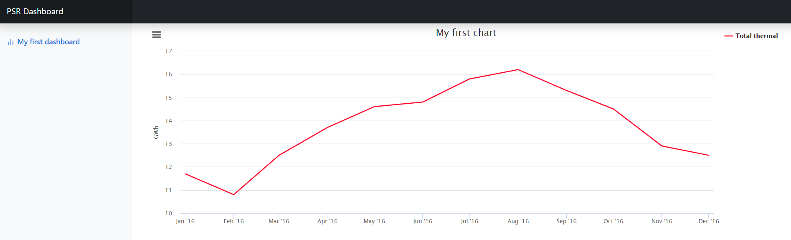

# Getting Started
{: .no_toc }

## Table of contents
{: .no_toc .text-delta }

1. TOC
{:toc}

---

## Creating a Script

As an introduction to PSRIO, we will show you how to create PSRIO recipes from scratch using the output data from example cases inside the installation folder of SDDP. For the explanation, case example 20 will be used. It consists, basically, of one system containing 3 thermal plants supplying energy to consumers. The study horizon is formed by 12 stages and the execution is deterministic.


#### Example 1

The first example is about demand marginal cost. We wish to get an average demand marginal cost from the information in the file `cmgdem.csv`. Therefore, since demand marginal cost is a system-level variable, we can start loading the system collections with following command:

``` lua
system = require("collection/system");
```

Then, the marginal cost data in the file `cmgdem.csv` is loaded with:

``` lua
cmgdem = system:load("cmgdem");
```

The data can be seen in the image below:

<div style="text-align:center">
    
</div>

The processing is accomplished using the method `aggregate_stages`, passing the parameter `BY_AVERAGE()`:

``` lua
cmgdem_avg = cmgdem:aggregate_stages(BY_AVERAGE());
```

We finish it out saving our data to the file `cmgdem_avg.bin`. 

``` lua
cmgdem_avg:save("cmgdem_avg");
```

If you wish to save the information in a `.csv` file, an additional parameter must be used to indicate that:

``` lua
cmgdem_avg:save("cmgdem_avg", {csv=true});
```

Let's see what the final result looks like:

<div style="text-align:center">
    
</div>

As we can see, the stages collapsed into one single value representing the average value of the demand marginal costs over the study horizon. 

#### Example 2

Suppose we want to extract the total amount of energy generated by the plants based on the information received from SDDP about the generations in each stage of each plant, which can be found in the file `gerter.csv`. We will begin loading the thermal collections with the following commad:

``` lua 
thermal_plants = require("collection/thermal");
```

Now, we have access to the attributes of each thermal plant in the system. As our interest lies in the generation, we will load the generation data with the command:

``` lua 
thermal_gen=thermal_plants:load("gerter");
```

Check the data contained in the file:

<div style="text-align:center">
    
</div>

Notice that we managed to load the generation data by informing the file name identification of the data. Now, we are able to make operations with the generation data. We want to sum values of each plant regarding one stage, so that there is only one value per stage that represents the total generation of the system. For that, we do the following:

``` lua 
total_thermal_gen = thermal_gen:aggregate_agents(BY_SUM(), "Total thermal");

total_thermal_gen:save("TotalThermalGen", {csv=true});
```

The first instruction tells PSRIO to aggregate agents, summing their respective generation for each stage. In the second, we are saving the data stored in the variable total_thermal to the file `TotalThermalGen.csv`. The processed data looks like this:

<div style="text-align:center">
    
</div>

 The best way to visualize data is by plots, so we will also make one of them. First, let’s define a object for the chart.

``` lua 
my_chart = Chart();
```

Now, we indicate to the chart object that we want to plot the data contained in the file `TotalThermalGen.csv`, which we have just created.

``` lua 
my_chart:push("TotalThermalGen", "line");
```

After that, we will define a dashboard object to hold chart objects information and then add the charts and save to the file `ThermalReport.html`.

``` lua 
my_dash = Dashboard();
my_dash:push(my_chart);
my_dash:save("ThermalReport");
```

By clicking in the file `ThermalReport.html`, that's what we get:

<div style="text-align:center">
    
</div>

In short, the recipe for this work is as follows:

``` lua 
--Load thermal collections and thermal generation data
thermal_plants = require("collection/thermal");
thermal_gen=thermal_plants:load("gerter");

--Aggregate agents generations by sum and save to output file
total_thermal_gen = thermal_gen:aggregate_agents(BY_SUM(), "Total thermal");
total_thermal_gen:save("TotalThermalGen", {csv=true});

--Create chart object
my_chart = Chart();

--Add total generation info
my_chart:push("TotalThermalGen", "line");

--Create dashboad object
my_dash = Dashboard();

--Add chart and save to html file
my_dash:push(my_chart);
my_dash:save("ThermalReport");
```

There are 3 ways to run the script above. We are now going to explain each one of them in the next section of this tutorial.

## Running a script

### Graph 4.0


### SDDP

The instructions to PSRIO can be put in a `.lua` file inside the example case directory. At the end of execution of SDDP, PSRIO will find your `.lua` and run it, executing the all the instruction contained in it.

### Command Line

Using the command line terminal of your operating system, you can execute PSRIO, passing the path to your case as argument, and inform the commands.


